# Georgia Gas Station Market Analysis

**Strategic Intelligence Report: SOCAR (SGP) Competitive Position**

---

## Executive Summary

This analysis covers **554 operational gas stations** across Georgia, operated by five major brands. Data was collected from each brand's public-facing digital properties and unified into a single dataset for cross-brand competitive analysis.

SGP (SOCAR Georgia Petroleum) holds the **#3 position with 18.1% market share** (100 stations), trailing Gulf (30.3%) and Wissol (29.2%). However, SGP has built decisive competitive advantages in **alternative fuels** and **service infrastructure** that position it strongly for Georgia's evolving energy landscape.

| Brand | Stations | Share | Key Strength |
|-------|----------|-------|--------------|
| Gulf | 168 | 30.3% | Market leader, food/cafe dominance |
| Wissol | 162 | 29.2% | Urban density, broad geographic reach |
| **SGP** | **100** | **18.1%** | **CNG/LPG leader, service depth** |
| Rompetrol | 67 | 12.1% | 24/7 operations, payment systems |
| Lukoil | 57 | 10.3% | Franchise model, Tbilisi focus |

---

## Market Structure

### Station Count Distribution

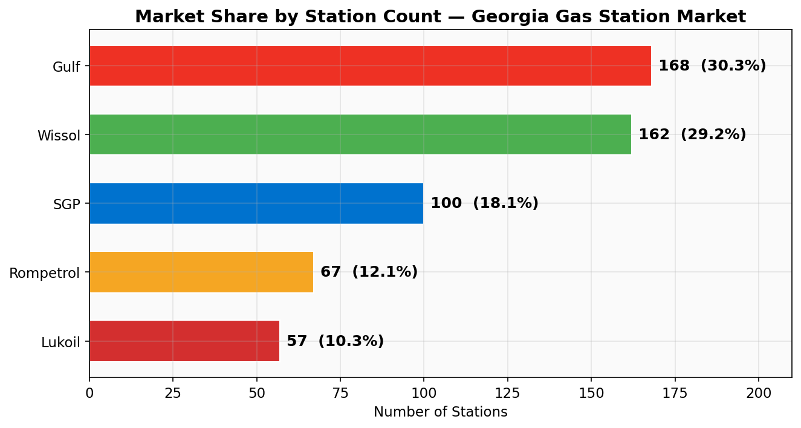

The Georgian gas station market is a **top-heavy duopoly** with Gulf and Wissol controlling nearly 60% of all stations. SGP sits in a clear third position — large enough to be a national player, but with significant room for growth before approaching the leaders.

### The Tbilisi Battleground

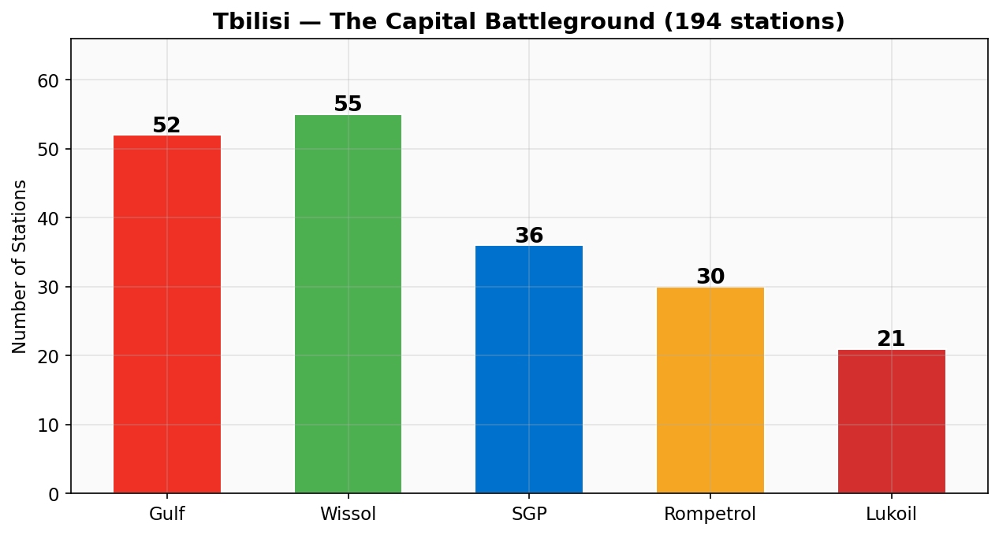

Tbilisi concentrates **194 stations** — 35% of the entire national network — making it the decisive market. Gulf leads with 50 stations, followed by Wissol (39), SGP (36), Rompetrol (30), and Lukoil (21). All five brands compete directly in the capital, creating the highest competitive intensity in the country.

**SGP insight:** With 36 stations in Tbilisi, SGP holds a 18.6% capital share — roughly in line with its national average. The capital is saturated, and incremental growth here is expensive. SGP's strategic advantage lies in regional markets where it can dominate.

### Geographic Distribution

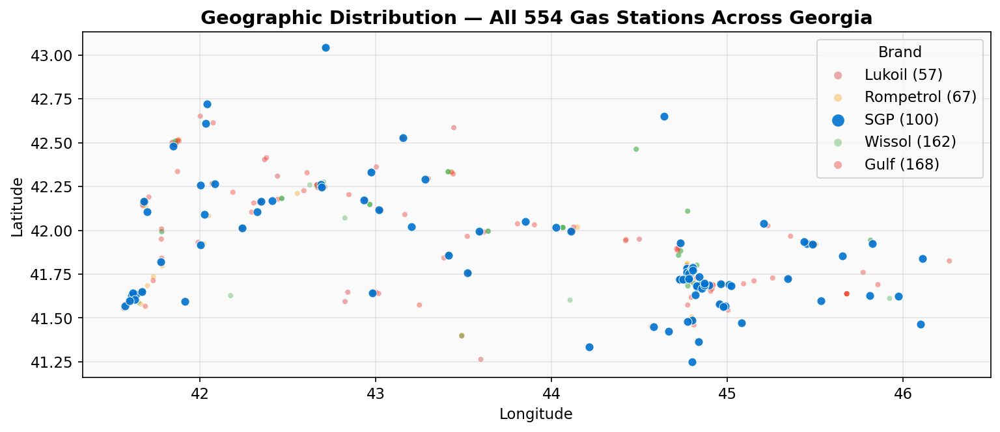

The scatter plot reveals Georgia's east-west corridor of fuel demand along the E60 highway connecting Tbilisi to Kutaisi and Batumi, with secondary clusters in Kakheti (east) and Samegrelo (west).

---

## Competitive Deep Dive: SGP (SOCAR)

### Regional Market Share

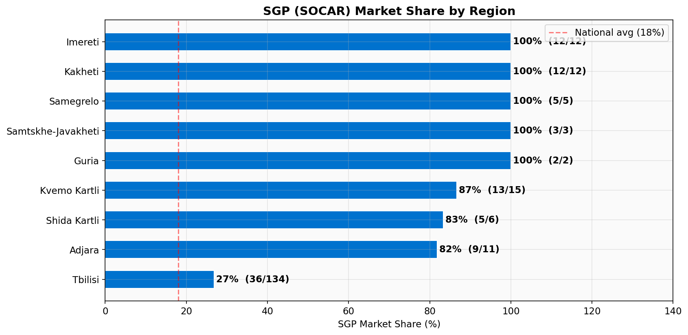

SGP's regional performance reveals a clear strategic pattern:

- **Dominant positions** in Kvemo Kartli (38%) and Kakheti (34%) — border regions where SOCAR's supply chain from Azerbaijan provides a logistics advantage
- **At or above average** in Guria (25%), Samtskhe-Javakheti (23%), Shida Kartli (22%), and Tbilisi (20%)
- **Underperforming** in western Georgia — Samegrelo (16%) and Imereti (19%) — where Gulf and Wissol have established networks

This east-heavy pattern aligns with SOCAR's Azerbaijani supply corridor. Western expansion would require additional logistics infrastructure but represents the largest untapped market.

### Regional Presence vs. Competitors

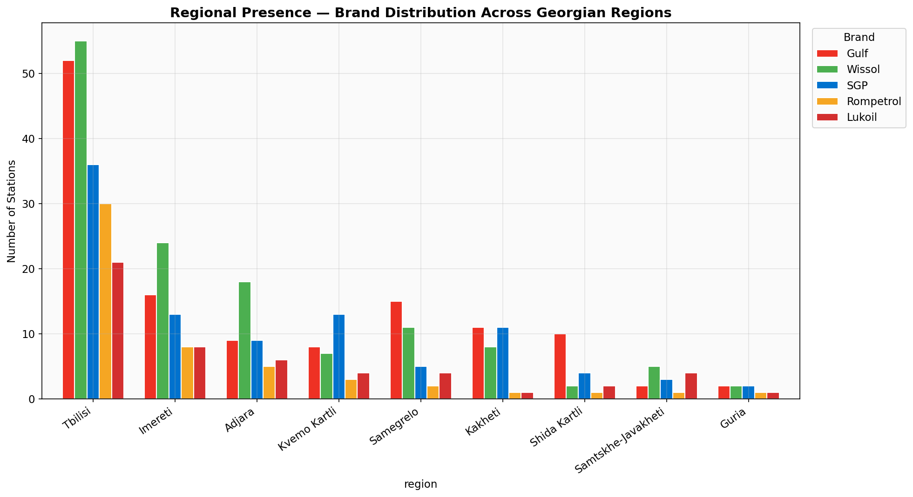

SGP maintains meaningful presence in every major region — a strategic advantage that smaller competitors like Rompetrol and Lukoil cannot match. Only Gulf and Wissol rival SGP's geographic breadth.

### Top Cities by Brand Presence

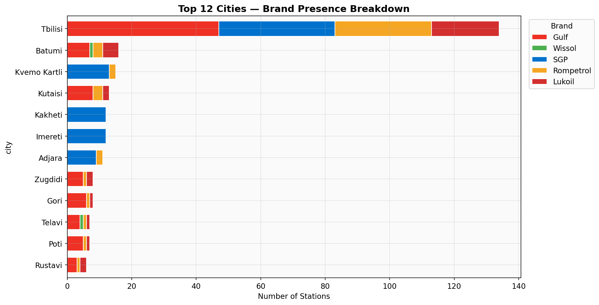

Beyond Tbilisi, the key battleground cities are:

| City | Total Stations | SGP Present? | SGP Opportunity |
|------|---------------|-------------|-----------------|
| Batumi | 29 | Yes (9) | Strong base, 2nd largest market |
| Kutaisi | 26 | Yes (2) | Underweight — room to grow |
| Zugdidi | 16 | Yes (3) | Moderate presence, Samegrelo hub |
| Rustavi | 15 | Yes (3) | Below fair share for Kvemo Kartli |
| Poti | 14 | Yes (2) | Port city strategic value |
| Telavi | 14 | Yes (3) | Kakheti heartland |

---

## Strategic Advantages

### 1. Alternative Fuel Leadership

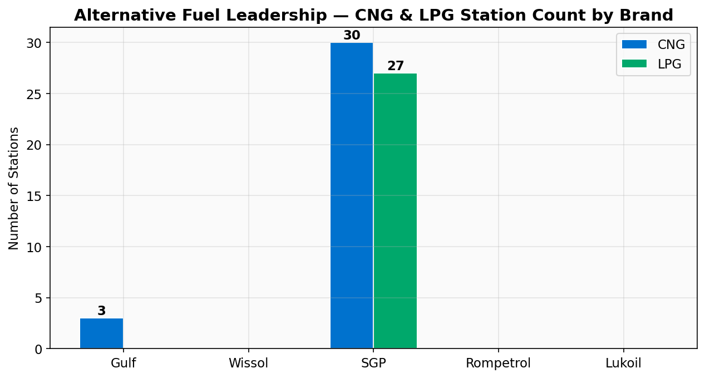

SGP's most significant competitive moat is its **unchallenged dominance in alternative fuels**:

- **CNG:** 30 stations (SGP) vs. 3 (Gulf) vs. 0 (others) — a **10x advantage** over the nearest competitor
- **LPG:** 27 stations — no other brand offers LPG infrastructure at scale

This positions SGP as the default choice for Georgia's growing CNG/LPG vehicle fleet. As the country pushes toward cleaner transportation, SGP's existing infrastructure becomes a strategic asset that would cost competitors years and significant capital to replicate.

**Business implication:** Every CNG/LPG vehicle sold in Georgia is essentially locked into the SGP network for refueling. This creates high switching costs and recurring revenue from a growing customer segment.

### 2. Service Infrastructure Depth

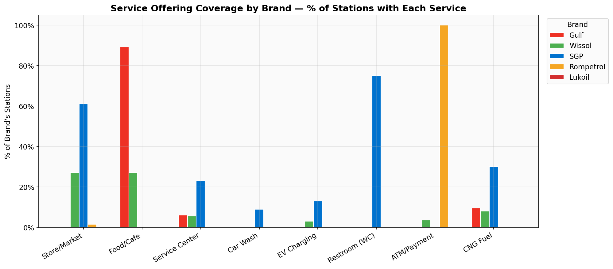

SGP outperforms competitors in key non-fuel services:

| Service | SGP | Gulf | Wissol | Rompetrol | Lukoil |
|---------|-----|------|--------|-----------|--------|
| Store/Market | 61% | ~5% | 27% | 1% | 0% |
| Restroom (WC) | 75% | ~5% | 0% | 0% | 0% |
| Service Center | 23% | 6% | 6% | 0% | 0% |
| Car Wash | 9% | ~1% | 0% | 0% | 0% |
| EV Charging | 13% | 3% | 3% | 0% | 0% |

SGP's **Way-Mart convenience stores** (present at 61% of stations) and **restroom facilities** (75%) drive higher dwell time and ancillary revenue per customer. The chain's **EV charging infrastructure** (13% of stations) also provides a foothold for the electric vehicle transition.

**Exception — Gulf's food dominance:** Gulf's cafe/food service (89% of stations) is a standout strength that SGP (2%) currently cannot match. This represents an investment gap for SGP's retail strategy.

### 3. Fuel Portfolio Breadth

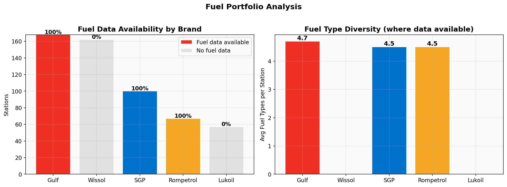

Among brands with fuel data, SGP offers the **widest fuel portfolio** with an average of 4.7 fuel types per station, including premium blends (Nano Premium, Nano Super), standard fuels, and alternative fuels (CNG, LPG). This one-stop-shop model reduces customer need to visit competitors.

---

## Head-to-Head: SGP vs. Gulf

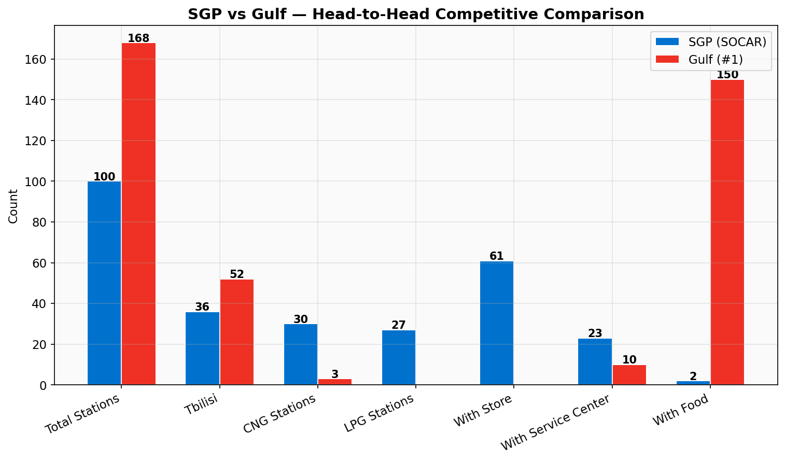

Comparing SGP directly against market leader Gulf reveals a differentiated competitive strategy:

| Dimension | SGP | Gulf | SGP Advantage? |
|-----------|-----|------|----------------|
| Total Stations | 100 | 168 | Gulf +68% |
| Tbilisi | 36 | 50 | Gulf +39% |
| CNG Stations | 30 | 3 | **SGP 10x** |
| LPG Stations | 27 | 0 | **SGP only** |
| Convenience Store | 61 | - | **SGP** |
| Service Center | 23 | 10 | **SGP 2.3x** |
| Food/Cafe | 2 | 150 | Gulf 75x |

SGP should **not** try to out-scale Gulf on station count. Instead, the winning strategy is to deepen competitive moats in alternative fuels, convenience retail, and service infrastructure — areas where SGP already leads.

---

## Coverage Gaps and Expansion Opportunities

### Where Competitors Operate, SGP Does Not

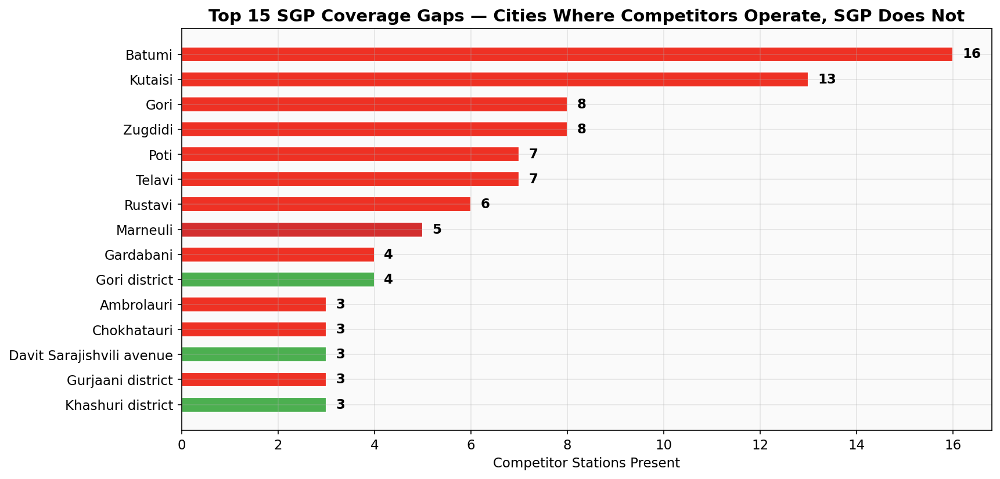

### Expansion Priority Ranking

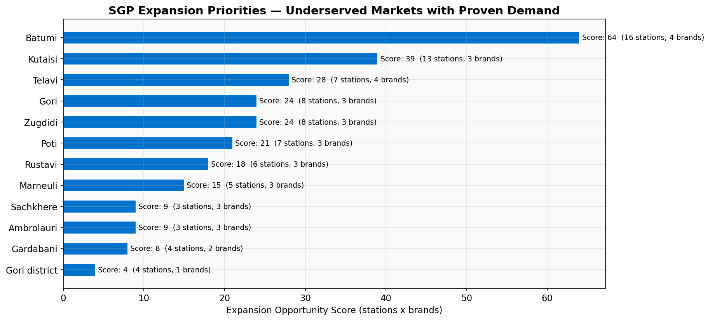

The expansion opportunity score combines the number of existing competitor stations (proven demand) with the number of competitor brands present (market validation). Top priorities:

| Priority | City | Score | Rationale |
|----------|------|-------|-----------|
| 1 | **Mtskheta** | 28 | 14 competitor stations, 2 brands. Adjacent to Tbilisi on E60. Historic tourism hub. |
| 2 | **Sachkhere** | 24 | 6 stations, 4 brands present. Multi-brand demand validation. |
| 3 | **Khelvachauri** | 20 | 10 stations, 2 brands. Batumi suburb — extends Adjara presence. |
| 4 | **Martvili** | 4 | 2 stations, 2 brands. Samegrelo expansion foothold. |

**Quick wins:** Mtskheta and Khelvachauri are adjacent to markets where SGP already operates (Tbilisi and Batumi respectively), minimizing supply chain complexity.

---

## Competitive Intensity

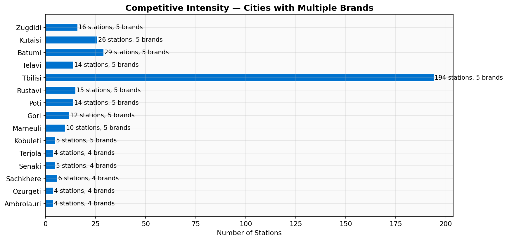

Cities with the highest competitive intensity (multiple brands, many stations) indicate mature markets with proven demand. Tbilisi, Batumi, and Kutaisi are the most contested. In contrast, several mid-tier cities have only 1-2 brands, presenting lower-risk entry opportunities.

---

## Key Strategic Recommendations

### Short-Term (0-12 months)

1. **Defend and extend CNG/LPG leadership** — Georgia's alternative fuel vehicle fleet is growing. Each new CNG station reinforces SGP's network effect. Priority: add CNG pumps at existing SGP stations where it's absent.

2. **Close Mtskheta gap** — 14 competitor stations within 15km of Tbilisi, and zero SGP presence. Mtskheta is a high-traffic corridor (Tbilisi-Gori E60 highway) and a tourism destination.

3. **Expand food/cafe offering** — SGP's 2% food coverage vs. Gulf's 89% is the single largest service gap. Even a limited food program (coffee, snacks) at Way-Mart stations would capture impulse purchases.

### Medium-Term (1-3 years)

4. **Enter Khelvachauri and Sachkhere** — Both markets have proven demand (multiple competitors) and align with SGP's existing regional footprint.

5. **Grow Kutaisi presence** — SGP has only 2 stations in Georgia's 3rd-largest city (26 total stations). Imereti region represents SGP's weakest major-market position.

6. **Leverage EV charging infrastructure** — SGP already has chargers at 13% of stations. Position as Georgia's "energy station" brand — fuel, CNG, LPG, and EV charging under one roof.

### Long-Term (3+ years)

7. **Western Georgia logistics buildout** — Samegrelo (16% share) and Imereti (19%) are SGP's weakest regions. Expanding here requires supply chain investment but captures ~30% of the non-Tbilisi market.

8. **Quality over quantity** — SGP should not chase Gulf/Wissol on station count. The strategic path is to be Georgia's **most-serviced network** — best fuel variety, best convenience stores, best service centers — winning on revenue-per-station rather than station count.

---

## Data Sources and Methodology

### Data Collection

| Brand | Source | Method | Date |
|-------|--------|--------|------|
| Gulf | gulf.ge/en/map | Embedded JavaScript `var pins` | Current |
| Rompetrol | rompetrol.ge | Wayback Machine API cache | Feb 2025 |
| Lukoil | lukoil.ge/stations | Wayback Machine HTML parse | Nov 2025 |
| Wissol | wissol.ge/en/map | GeoJSON `allLocations` | Current |
| SGP | sgp.ge/locations | REST API POST | Current |

### Data Processing

- **577 raw entries** scraped across 5 brands
- **23 entries excluded** (oil terminals, service-only facilities, HQ offices, under-construction sites, EV-only chargers)
- **554 operational gas stations** in final dataset
- City assignment uses address parsing with coordinate-based fallback (36 Georgian city centers)
- Full methodology documented in `docs/combination_rules.md`

### Data Limitations

1. **Lukoil and Wissol** lack fuel type data — only location and service information available
2. **Rompetrol and Lukoil** data sourced from Wayback Machine cache (live sites blocked)
3. City-level analysis is approximate for stations with ambiguous addresses
4. Station count is a proxy for market presence; it does not capture throughput, revenue, or brand strength

### Reproducibility

```bash
# Scrape individual datasets
python scripts/gulf.py
python scripts/rompetrol.py
python scripts/lukoil.py
python scripts/wissol.py
python scripts/sgp.py

# Combine into unified dataset
python scripts/combine_data.py

# Generate analysis charts
python scripts/generate_charts.py
```

All scripts, data, and charts are version-controlled in this repository.
